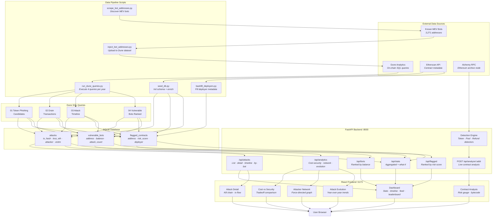

# PhishNet

**MEV Phishing Attack Monitor & Detection Dashboard**

An interactive security dashboard that detects and visualizes MEV phishing attacks targeting Ethereum MEV bots. Built on findings from the [SKANF paper](https://arxiv.org/abs/2504.13398) — *"Insecurity Through Obscurity: Veiled Vulnerabilities in Closed-Source Contracts"* — which discovered 104 phishing attacks totaling $2.76M in losses across 37 victim bots (July 2021 – April 2025).

---

## Architecture

### Tech Stack

| Layer | Technology |
|-------|-----------|
| Frontend | React 18 · TypeScript · Tailwind CSS · Recharts · D3.js · Vite |
| Backend | Python · FastAPI · Uvicorn |
| Database | SQLite |
| Data Sources | Dune Analytics · Etherscan API · Alchemy RPC |
| Detection | EVM bytecode analysis via pyevmasm + web3.py |

### Data Flow Diagram



---

## Project Structure

```
shape-rotator/
├── backend/
│   ├── main.py                      # FastAPI entry point
│   ├── database.py                  # SQLite connection + schema
│   ├── excluded_addresses.py        # Noise filter list
│   ├── api/routes/
│   │   ├── attacks.py               # Attack CRUD + kill chain
│   │   ├── bots.py                  # Vulnerable bot leaderboard
│   │   ├── flagged.py               # Flagged contract listing
│   │   ├── stats.py                 # Aggregated statistics
│   │   └── analytics.py            # Cost-security, network, evolution
│   ├── core/
│   │   ├── data_fetcher.py          # Web3 + Etherscan wrappers
│   │   ├── bytecode_analyzer.py     # EVM opcode extraction
│   │   ├── call_analyzer.py         # Vulnerable CALL detection
│   │   ├── obfuscation_analyzer.py  # Control flow obfuscation scoring
│   │   ├── kill_chain.py            # Kill chain reconstruction
│   │   └── what_if.py               # Prevention what-if analysis
│   ├── detectors/
│   │   ├── token_detector.py        # Token-based phishing (101/104 attacks)
│   │   ├── pool_detector.py         # Pool-based phishing (3/104 attacks)
│   │   └── refund_detector.py       # Refund-based phishing (novel)
│   ├── scripts/
│   │   ├── scrape_bot_addresses.py  # Discover known MEV bots
│   │   ├── inject_bot_addresses.py  # Upload bot list to Dune
│   │   ├── run_dune_queries.py      # Execute Dune queries → SQLite
│   │   ├── seed_db.py               # Init schema + Etherscan enrichment
│   │   └── backfill_deployers.py    # Fill deployer metadata
│   ├── data/
│   │   ├── phishnet.db              # SQLite database
│   │   ├── dune_query_ids.json      # Cached Dune query IDs
│   │   ├── seed/
│   │   │   ├── known_mev_bots.json  # 3,271 bot addresses
│   │   │   └── known_mev_bots.csv
│   │   └── dune_queries/
│   │       ├── 01_token_phishing_candidates.sql
│   │       ├── 02_drain_transactions.sql
│   │       ├── 03_attack_timeline.sql
│   │       └── 04_vulnerable_bots_ranked.sql
│   ├── requirements.txt
│   └── .env
│
└── frontend/
    ├── src/
    │   ├── App.tsx                   # Router setup
    │   ├── api/client.ts            # Axios API client + types
    │   ├── types/index.ts           # Shared TypeScript types
    │   ├── pages/
    │   │   ├── Dashboard.tsx         # Main dashboard
    │   │   ├── AttackDetail.tsx      # Kill chain + tx flow
    │   │   ├── ContractAnalysis.tsx  # Risk gauge + bytecode
    │   │   ├── CostSecurity.tsx      # Gas cost vs security
    │   │   ├── AttackerNetwork.tsx   # Force-directed graph
    │   │   └── AttackEvolution.tsx   # Year-over-year trends
    │   ├── components/
    │   │   ├── layout/              # Header, Sidebar
    │   │   ├── dashboard/           # StatsPanel, AttackTimeline, LiveFeed, Leaderboard
    │   │   ├── attack/              # KillChainViz, TxFlowPanel
    │   │   ├── contract/            # RiskAssessment, BytecodeAnalysis, DeployerCluster
    │   │   └── shared/              # RiskBadge, AddressChip
    │   └── hooks/                   # useAttacks, useBots, useFlagged
    ├── package.json
    ├── vite.config.ts
    ├── tailwind.config.js
    └── tsconfig.json
```

---

## Detection Modules

PhishNet implements three detector modules based on the SKANF kill chain taxonomy:

| Module | Coverage | Attack Mechanism | Key Signals |
|--------|----------|------------------|-------------|
| **Token Detector** | ~101/104 | Malicious ERC-20 `transfer()` exploits `tx.origin` to drain bot | ERC-20 interface, dangerous selectors, `tx.origin`, embedded bot addresses |
| **Pool Detector** | ~3/104 | Fake Uniswap pool with callback exploit during swap | Fresh suspicious tokens, dangerous selectors, `tx.origin` in pool bytecode |
| **Refund Detector** | Novel | Contract's fallback function exploits `tx.origin` on refund receipt | Non-trivial fallback, external CALLs, refund service registration |

Each detector produces a **risk score (0–100)** composed of weighted signals.

---

## Getting Started

### Prerequisites

- Python 3.10+
- Node.js 18+
- API keys: Etherscan, Alchemy, Dune Analytics

### Backend

```bash
cd backend
python -m venv .venv
source .venv/bin/activate
pip install -r requirements.txt

# Set up environment
cp .env.example .env
# Edit .env with your API keys

# Initialize database
python scripts/seed_db.py

# Import data from Dune (per year)
python scripts/run_dune_queries.py --year 2023

# Start server
uvicorn main:app --reload
```

### Frontend

```bash
cd frontend
npm install
npm run dev
```

The frontend runs at `http://localhost:5173` and proxies API requests to the backend at `:8000`.

---

## Data Pipeline

```
1. scrape_bot_addresses.py    → Discover 3,271 MEV bot addresses
2. inject_bot_addresses.py    → Upload bot list to Dune Analytics dataset
3. run_dune_queries.py        → Execute 4 SQL queries per year → SQLite
4. seed_db.py --enrich        → Enrich records via Etherscan
5. backfill_deployers.py      → Fill deployer metadata for flagged contracts
```

### Dune Queries

| # | Query | Purpose |
|---|-------|---------|
| 01 | Token Phishing Candidates | Find fresh ERC-20 tokens targeting MEV bots with dynamic risk scoring |
| 02 | Drain Transactions | Identify ETH/WETH outflows from known bots to attacker addresses |
| 03 | Attack Timeline | Monthly aggregated attack counts and loss amounts |
| 04 | Vulnerable Bots Ranked | Rank bots by ETH balance at risk and attack frequency |

---

## Database Schema

**attacks** — Historical phishing attack records
- `tx_hash`, `block_number`, `timestamp`, `attack_type` (token/pool/refund)
- `attacker_address`, `victim_bot_address`, `malicious_contract`
- `loss_eth`, `loss_usd`, `previously_known`, `data_year`

**flagged_contracts** — Detected suspicious contracts
- `address`, `deployed_at`, `contract_type`, `risk_score` (0–100)
- `detection_signals` (JSON), `targeted_bot`, `status`, `deployer`

**vulnerable_bots** — MEV bots with attack history
- `address`, `vulnerability_type` (tx_origin/unvalidated_call/both)
- `total_loss_eth`, `current_balance_eth`, `attack_count`, `is_active`

---

## References

- [SKANF Paper (arXiv:2504.13398)](https://arxiv.org/abs/2504.13398) — *Insecurity Through Obscurity: Veiled Vulnerabilities in Closed-Source Contracts*
- [Dune Analytics](https://dune.com) — On-chain data queries
- [Etherscan](https://etherscan.io) — Contract metadata and transaction history
