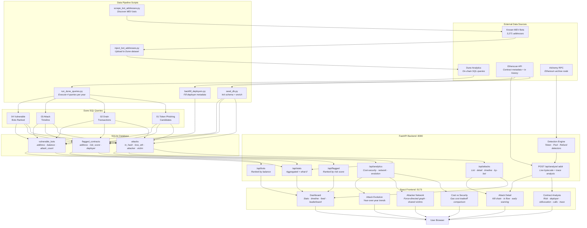

# PhishNet

**Real-Time MEV Phishing Attack Monitor & Detection Dashboard**

An interactive security dashboard that detects and visualizes MEV phishing attacks targeting Ethereum MEV bots. Built on findings from the [SKANF paper](https://arxiv.org/abs/2504.13398) — *"Insecurity Through Obscurity: Veiled Vulnerabilities in Closed-Source Contracts"* — which discovered 104 phishing attacks totaling $2.76M in losses across 37 victim bots (July 2021 – April 2025).

PhishNet operationalizes this research into a usable tool: from high-level attack trends down to bytecode-level forensics, giving the MEV ecosystem the visibility it needs to defend against phishing attacks.

---

## Features

### Dashboard
The main landing page with real-time metrics and monitoring panels:
- **Stats Panel** — Total attacks tracked, cumulative ETH losses, bots at risk, and preventable loss (what-if analysis)
- **Attack Timeline** — Scatter plot of every drain event over time, filterable by year
- **Live Detection Feed** — Simulated real-time monitoring of newly deployed contracts flagged as suspicious, showing risk scores and targeted bots
- **Risk Leaderboard** — Most vulnerable MEV bots ranked by current ETH balance still at risk

### Contract Analysis
On-demand deep forensic analysis of any Ethereum contract address:
- **Risk Assessment** — Overall vulnerability score (0–100) with checklist: `tx.origin` usage, unvalidated calls, active status, attack history
- **Deployer Analysis** — Identifies the contract deployer and all other contracts deployed by the same address, revealing serial attacker campaigns
- **Obfuscation Analysis** *(SKANF §3.2)* — Measures bytecode obfuscation: direct vs indirect jumps, reachable vs dead jump destinations, code density, and dead code bytes
- **Vulnerable Call Finder** *(SKANF §3.3)* — Disassembles bytecode to identify every CALL, STATICCALL, and DELEGATECALL instruction, checks for access control guards (CALLER/ORIGIN + EQ), and flags unprotected calls
- **Trace-Guided Analysis** *(SKANF-inspired)* — Cross-references actual transaction history from Etherscan with bytecode analysis to determine if vulnerable code paths were really triggered, not just that they exist. Shows called vs uncalled function selectors and tx.origin proximity
- **Attack History** — Full table of every recorded attack against the contract with dates, ETH losses, attacker/drain addresses, and transaction hashes

### Attack Detail — Kill Chain
Reconstructs the three-step kill chain for each phishing attack:
1. **Deploy** — Attacker deploys a malicious token contract with hidden exploit code
2. **Lure** — Attacker sends the token to the victim MEV bot as a fake arbitrage opportunity
3. **Drain** — When the bot processes the token, the malicious code exploits `tx.origin` to impersonate the bot owner and drain all ETH

Each attack detail page includes:
- **Transaction Flow Panel** — Actual on-chain calls with block numbers and amounts
- **PhishNet Early Warning** — Shows the ~24-second detection window between contract deployment (Step 1) and drain (Step 3), with a live detection result and risk score
- **Victim Bot Bytecode Analysis** — Obfuscation and vulnerable call analysis for the victim bot

### Attacker Network Graph
Force-directed graph visualization of the attacker-victim ecosystem:
- **Red nodes** = attacker deployer addresses (sized by attack count)
- **Blue nodes** = victim MEV bots
- **Edges** = attack relationships
- Adjustable minimum attack threshold to filter to the most prolific serial attackers
- **Shared Victims table** — Bots targeted by multiple independent attackers, proving coordinated discovery of vulnerable targets

### Attack Evolution
Year-over-year analysis of how the attack landscape changed:
- Yearly metrics: total attacks, unique victims, unique attackers, total/avg/max losses, serial attacker count
- **Monthly Attack Volume** chart showing temporal patterns (e.g., early 2021 DeFi bull market spike)
- Data transparency: openly acknowledges Dune query limitations where applicable

### Cost vs Security *(SKANF §7.1)*
Answers why MEV bots use `tx.origin` despite the risk:
- Comparison of four authentication methods: `tx.origin`, `msg.sender`, `ecrecover`, CREATE2 verification
- Gas cost per call and monthly USD cost for each method
- Key finding: switching from `tx.origin` to `msg.sender` costs only **$0.30/month extra** — negligible compared to millions in potential losses

---

## Architecture

### Tech Stack

| Layer | Technology |
|-------|-----------|
| Frontend | React 18 · TypeScript · Tailwind CSS · Recharts · D3.js · Vite |
| Backend | Python · FastAPI · Uvicorn |
| Database | SQLite |
| Data Sources | Dune Analytics · Etherscan API · Alchemy RPC |
| Detection | EVM bytecode analysis via pyevmasm + web3.py |
| Deployment | Vercel (frontend + backend serverless) |

### Data Flow Diagram



---

## Detection Modules

PhishNet implements three detector modules based on the SKANF kill chain taxonomy:

| Module | Coverage | Attack Mechanism | Key Signals |
|--------|----------|------------------|-------------|
| **Token Detector** | ~101/104 | Malicious ERC-20 `transfer()` exploits `tx.origin` to drain bot | ERC-20 interface, dangerous selectors, `tx.origin`, embedded bot addresses |
| **Pool Detector** | ~3/104 | Fake Uniswap pool with callback exploit during swap | Fresh suspicious tokens, dangerous selectors, `tx.origin` in pool bytecode |
| **Refund Detector** | Novel | Contract's fallback function exploits `tx.origin` on refund receipt | Non-trivial fallback, external CALLs, refund service registration |

Each detector produces a **risk score (0–100)** composed of weighted signals.

---

## Bytecode Analysis Engine

PhishNet includes three layers of EVM bytecode analysis, inspired by the SKANF paper:

### Obfuscation Analysis *(§3.2)*
Measures how much a contract obfuscates its logic:
- **Jump analysis** — Direct vs indirect jumps (indirect jumps hide control flow)
- **JUMPDEST analysis** — Reachable vs dead jump destinations (dead = unreachable code padding)
- **Code density** — Ratio of meaningful instructions to total bytes
- **Dead code detection** — Bytes that can never be executed

### Vulnerable Call Finder *(§3.3)*
Disassembles bytecode to find unprotected external calls:
- Identifies every `CALL`, `STATICCALL`, and `DELEGATECALL` instruction
- Checks for access control guards (`CALLER`/`ORIGIN` + `EQ` patterns)
- Flags `DELEGATECALL` as highest risk (executes in caller's context)
- Produces per-call risk scores and an overall auth type assessment

### Trace-Guided Analysis *(SKANF-inspired)*
Cross-references live transaction history with static bytecode analysis:
- Fetches recent transactions via Etherscan `txlist` API
- Extracts 4-byte function selectors from calldata
- Matches called selectors against bytecode PUSH4 instructions
- Checks proximity of called selectors to ORIGIN opcode (within 300 bytes)
- Identifies uncalled "hidden" selectors that exist in bytecode but were never invoked
- Produces a combined risk score factoring in vulnerable called functions, dangerous selectors, caller count, and hidden function count

---

## Project Structure

```
PhishNet/
├── backend/
│   ├── main.py                      # FastAPI entry point + CORS
│   ├── database.py                  # SQLite connection + schema
│   ├── excluded_addresses.py        # Noise filter list
│   ├── api/
│   │   ├── index.py                 # Vercel serverless entry point
│   │   ├── routes/
│   │   │   ├── attacks.py           # Attack CRUD + kill chain + trace analysis
│   │   │   ├── bots.py              # Vulnerable bot leaderboard
│   │   │   ├── flagged.py           # Flagged contract listing + deployer info
│   │   │   ├── stats.py             # Aggregated statistics
│   │   │   └── analytics.py         # Cost-security, network, evolution
│   │   └── schemas.py               # Pydantic response schemas
│   ├── core/
│   │   ├── data_fetcher.py          # Web3 + Etherscan API wrappers
│   │   ├── bytecode_analyzer.py     # EVM opcode extraction + selector finding
│   │   ├── call_analyzer.py         # Vulnerable CALL/DELEGATECALL detection
│   │   ├── obfuscation_analyzer.py  # Control flow obfuscation scoring
│   │   ├── trace_analyzer.py        # Trace-guided analysis (SKANF-inspired)
│   │   ├── kill_chain.py            # Kill chain reconstruction
│   │   └── what_if.py               # Prevention what-if analysis
│   ├── detectors/
│   │   ├── token_detector.py        # Token-based phishing (101/104 attacks)
│   │   ├── pool_detector.py         # Pool-based phishing (3/104 attacks)
│   │   └── refund_detector.py       # Refund-based phishing (novel)
│   ├── scripts/
│   │   ├── scrape_bot_addresses.py  # Discover known MEV bots
│   │   ├── inject_bot_addresses.py  # Upload bot list to Dune
│   │   ├── run_dune_queries.py      # Execute Dune queries → SQLite
│   │   ├── seed_db.py               # Init schema + Etherscan enrichment
│   │   └── backfill_deployers.py    # Fill deployer metadata
│   ├── data/
│   │   ├── phishnet.db              # SQLite database
│   │   ├── seed/
│   │   │   └── known_mev_bots.json  # 3,271 bot addresses
│   │   └── dune_queries/
│   │       ├── 01_token_phishing_candidates.sql
│   │       ├── 02_drain_transactions.sql
│   │       ├── 03_attack_timeline.sql
│   │       └── 04_vulnerable_bots_ranked.sql
│   └── requirements.txt
│
└── frontend/
    ├── src/
    │   ├── App.tsx                   # Router setup
    │   ├── api/client.ts            # Axios API client + types
    │   ├── types/index.ts           # Shared TypeScript types
    │   ├── pages/
    │   │   ├── Dashboard.tsx         # Main dashboard
    │   │   ├── AttackDetail.tsx      # Kill chain + tx flow + early warning
    │   │   ├── ContractAnalysis.tsx  # Full forensic analysis page
    │   │   ├── CostSecurity.tsx      # Gas cost vs security tradeoff
    │   │   ├── AttackerNetwork.tsx   # Force-directed graph
    │   │   └── AttackEvolution.tsx   # Year-over-year trends
    │   ├── components/
    │   │   ├── layout/              # Header
    │   │   ├── dashboard/           # StatsPanel, AttackTimeline, LiveFeed, Leaderboard
    │   │   ├── attack/              # KillChainViz, TxFlowPanel, EarlyWarning
    │   │   ├── contract/            # RiskAssessment, BytecodeAnalysis, DeployerCluster, TraceAnalysis
    │   │   └── shared/              # RiskBadge, AddressChip
    │   └── hooks/                   # useAttacks, useBots, useFlagged
    ├── package.json
    ├── vite.config.ts
    ├── tailwind.config.js
    ├── vercel.json
    └── tsconfig.json
```

---

## Getting Started

### Prerequisites

- Python 3.10+
- Node.js 18+
- API keys: Etherscan, Alchemy, Dune Analytics

### Backend

```bash
cd backend
python -m venv .venv
source .venv/bin/activate
pip install -r requirements.txt

# Set up environment
cp .env.example .env
# Edit .env with your API keys (ALCHEMY_RPC_URL, ETHERSCAN_API_KEY)

# Initialize database
python scripts/seed_db.py

# Import data from Dune (per year)
python scripts/run_dune_queries.py --year 2023

# Start server
uvicorn main:app --reload
```

### Frontend

```bash
cd frontend
npm install
npm run dev
```

The frontend runs at `http://localhost:5173` and proxies API requests to the backend at `:8000`.

---

## Deployment (Vercel)

PhishNet is deployed as two separate Vercel projects from the same repository:

| | Backend | Frontend |
|---|---|---|
| **Root Directory** | `backend` | `frontend` |
| **Framework** | Other (Python) | Vite |
| **Entry Point** | `api/index.py` (auto-discovered) | `npm run build` → `dist/` |

### Environment Variables

**Backend:**
| Variable | Description |
|---|---|
| `ALCHEMY_RPC_URL` | Alchemy Ethereum mainnet RPC URL |
| `ETHERSCAN_API_KEY` | Etherscan API key |
| `FRONTEND_URL` | Frontend Vercel URL (for CORS) |

**Frontend:**
| Variable | Description |
|---|---|
| `VITE_API_URL` | Backend Vercel URL (e.g. `https://phish-net-nu.vercel.app`) |

---

## Data Pipeline

```
1. scrape_bot_addresses.py    → Discover 3,271 MEV bot addresses
2. inject_bot_addresses.py    → Upload bot list to Dune Analytics dataset
3. run_dune_queries.py        → Execute 4 SQL queries per year → SQLite
4. seed_db.py --enrich        → Enrich records via Etherscan
5. backfill_deployers.py      → Fill deployer metadata for flagged contracts
```

### Dune Queries

| # | Query | Purpose |
|---|-------|---------|
| 01 | Token Phishing Candidates | Find fresh ERC-20 tokens targeting MEV bots with dynamic risk scoring |
| 02 | Drain Transactions | Identify ETH/WETH outflows from known bots to attacker addresses |
| 03 | Attack Timeline | Monthly aggregated attack counts and loss amounts |
| 04 | Vulnerable Bots Ranked | Rank bots by ETH balance at risk and attack frequency |

---

## Database Schema

**attacks** — Historical phishing attack records
- `tx_hash`, `block_number`, `timestamp`, `attack_type` (token/pool/refund)
- `attacker_address`, `victim_bot_address`, `malicious_contract`
- `loss_eth`, `loss_usd`, `previously_known`, `data_year`

**flagged_contracts** — Detected suspicious contracts
- `address`, `deployed_at`, `contract_type`, `risk_score` (0–100)
- `detection_signals` (JSON), `targeted_bot`, `status`, `deployer`

**vulnerable_bots** — MEV bots with attack history
- `address`, `vulnerability_type` (tx_origin/unvalidated_call/both)
- `total_loss_eth`, `current_balance_eth`, `attack_count`, `is_active`

---

## Key Findings

- **100% of analyzed MEV bots** use `tx.origin` for access control — the cheapest but most exploitable method
- Switching to `msg.sender` costs only **$0.30/month extra** in gas fees but prevents all callback phishing attacks
- **Serial attackers** (5+ attacks) number 120–150 per year, indicating professionalized operations
- Bots are independently discovered and targeted by **multiple unrelated attackers** — proven by the Shared Victims analysis
- Many malicious contracts **self-destruct** after the attack to evade forensic analysis

---

## References

- [SKANF Paper (arXiv:2504.13398)](https://arxiv.org/abs/2504.13398) — *Insecurity Through Obscurity: Veiled Vulnerabilities in Closed-Source Contracts*
- [Dune Analytics](https://dune.com) — On-chain data queries
- [Etherscan](https://etherscan.io) — Contract metadata and transaction history
